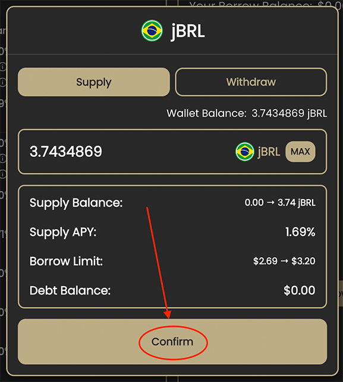

# Earning Yield on Midas Pools

**Step 1: Connect a Wallet**

The Midas Capital currently supports [MetaMask](https://metamask.io/), and [WalletConnect](https://walletconnect.org/). If you do not have a wallet, we recommend you refer to [this guide ](https://metamask.zendesk.com/hc/en-us/articles/360015489531-Getting-Started-With-MetaMask-Part-1)for [MetaMask](https://metamask.io/). Users can connect their wallets by selecting the "Connect Wallet" button.

<figure><figcaption></figcaption></figure>

**Step 2: Become Friendly With the Midas Dashboard**

Once connected, users will see _Supply Balance_ and _Borrow Balance._ It's okay for these to both be $0 when you connect for the first time.&#x20;

Now that you are looking at the main dashboard, it's time to start getting comfortable with the user experience. Normally when you enter an open interest rate protocol portal like [Compound Finance](https://compound.finance/) or [Aave](https://aave.com/), you will immediately see supply and borrow tabs. This is different for Fuse, as you have to select the pool you want to lend or borrow first!&#x20;

Once you select the pool that fits your choice of assets and parameters, you will now be looking at a screen with two sides: Supply and Borrow.&#x20;

The Supply side (left) shows assets that you can supply to this specific Fuse pool to earn interest, while the Borrow side (right) shows assets that you can borrow from this specific Fuse pool.&#x20;

Remember, everything you do in one Fuse pool is kept isolated from the rest of the pools on the platform.

<figure><figcaption></figcaption></figure>

**Step 3: Supply Assets to Midas pools**

1. Select the asset that you would like to supply.
2.  Enable permissions for the Midas Capital protocol to interact with your asset by confirming the  transaction.

    _Note: this is a transaction that will cost gas._
3. A new window will pop up on your screen displaying the current supply APY and it will adjust based on the amount you type in.
4.  Now that the token has been enabled and you have typed in your desired amount to lend, click Confirm and you are all done!

    _Note: this is a transaction that will cost gas._

<figure><figcaption>
Supplying jBRL into the pool
</figcaption></figure>

You have now supplied your first asset to a Midas pool! On your main dashboard, you will see _Supply Balance_ populate with the equivalent amount (in dollars) to your newly supplied asset.

_Note: This asset will no longer appear in your wallet as it is now within the Midas Capital protocol. You will immediately receive an fToken that represents your share in the pool. You will not have to worry about this token, but when you withdraw, your fToken will be used to redeem the underlying supply balance._

_You will only earn interest when the pool is being utilized by borrowers._


**Good to know:** your product docs aren't just a reference of all your features! use them to encourage folks to perform certain actions and discover the value in your product.

