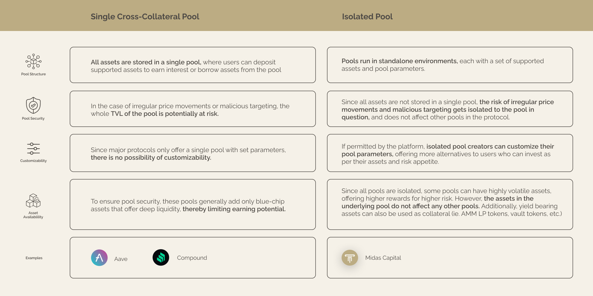

# Midas For Partners

The core of the Midas Protocol is the ability for any _community_ to enjoy the ability to have a completely customised market of their own. These markets are, at their core, the place where liquidity, collateral, and yield intersect.

**Liquidity:** Midas is focused on providing liquidity through the collateralization of assets in the most capital efficient manner possible.

**Market:** Midas is a place where liquidity providers (LPs) and borrowers meet to exchange collateral for liquidity.

**Yield**: Midas optimises capital allocation to be as productive as possible, allowing LPs to earn risk adjusted returns that keep the system in balance. Yield in Midas can originate from plugin into external sources as well as can be generated internally through the modalities of the market.

These tenants are what enables any community to leverage Midas in a way that their members can benefit from an entire new set of modalities in terms of how their assets are allocated and can be used productively.

### The Isolated Pool Model

The ability to support the widest ranges of communities without incurring the structural risks that many other money market suffer from comes from the fundamental way in which our platform is structured — the isolated pool model.

An isolated money market is a type of money market that operates independently from other money markets. In other words, it is not connected to or influenced by other money markets, and it has its own unique set of risk parameters and supported assets. Isolated money markets may be created for a variety of reasons, such as to support a specific type of asset, to serve a specific group of investors, or to facilitate transactions in a particular geographic region.

<figure><figcaption></figcaption></figure>

### Example Use-Cases:

* ****[**Long-tail and exotic asset support**](https://app.gitbook.com/s/66NW0CnbA4sgMbZnOH21/\~/changes/vykwvcjMVnGjvp9OAQFo/partner-and-pool-operator-documents/overview/introduction/long-tail-and-exotic-asset-support)****
* ****[**Liquid Staking Derivatives**](https://app.gitbook.com/s/66NW0CnbA4sgMbZnOH21/\~/changes/vykwvcjMVnGjvp9OAQFo/partner-and-pool-operator-documents/overview/introduction/liquid-staking-derivatives)****
* ****[**Forex Markets & Non-US Centric DeFi**](https://app.gitbook.com/s/66NW0CnbA4sgMbZnOH21/\~/changes/vykwvcjMVnGjvp9OAQFo/partner-and-pool-operator-documents/overview/introduction/forex-markets-and-non-us-centric-defi)****
* ****[**Delta-Neutral Strategies**](https://app.gitbook.com/s/66NW0CnbA4sgMbZnOH21/\~/changes/vykwvcjMVnGjvp9OAQFo/partner-and-pool-operator-documents/overview/introduction/delta-neutral-strategies)****
* ****[**AMM LP Pools**](https://app.gitbook.com/s/66NW0CnbA4sgMbZnOH21/\~/changes/vykwvcjMVnGjvp9OAQFo/partner-and-pool-operator-documents/overview/introduction/amm-lp-pools)****
