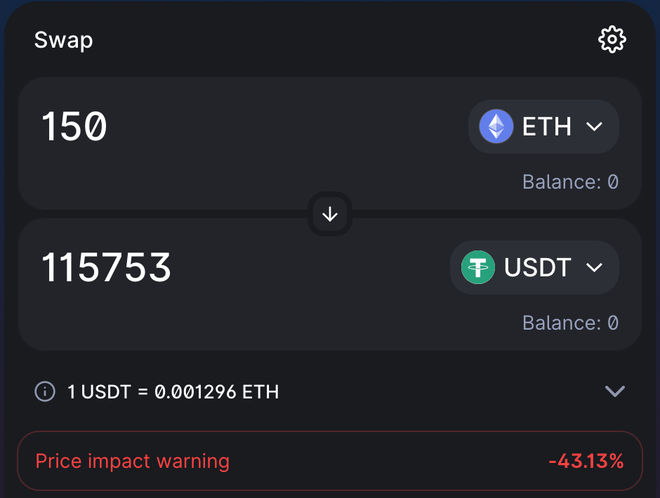

# Oracle Security

### What is an oracle?

```
Blockchain oracles are entities that connect blockchains to external systems, thereby enabling smart contracts to execute based upon inputs and outputs from the real world.[1]
```

Within the context of borrowing and lending, oracles are an essential part of the infrastructure. In particular, Oracles are needed to correctly _price_ an asset, as asset prices are not directly available on the blockchain.

In this context, oracles usually work in the following manner: based on a set of external price feeds (e.g.: the price feed of BTC/USD on Coinbase, Binance, an UniswapV2 on Ethereum), an _Oracle Provider_ will aggregate such price feeds and provide a smart contract that enables end users (such as a borrowing and lending pool on Ionic) to query the price of BTC/USD using on-chain calls.

### Oracle Risks

The fact that oracles serve to bring off-chain data into a blockchain inherently implies a security risk, as they bring data that is not validated by the blockchain's own consensus mechanism. While some Oracle solutions are more secure than others, it is essential to understand that no perfect implementation exists.

As mentioned previously, not all Oracles are created equally. As it has been observed in a multitude of hacks across the DeFi ecosystem, the level of difficulty and cost to manipulate an Oracle is usually what lies at the core of how secure such Oracle is.

To give a simple example, an Oracle that only uses UniswapV3 prices as its pricing mechanism can be subject to manipulations if the liquidity of the specific pair is not deep enough. Let's take for instance the ETH/USDT pair on UniswapV2. A large enough trade as seen in the screenshot below would cause a price impact of over 40%. While a trade like this would get arbitraged back quickly enough, an Oracle that simply returns the price of a token as given by a single source and that does not smooth out short-lived variations is doomed to be manipulated (especially because large sums of capital can be sourced in a single block via Flash Loans, making single-block oracle attacks particularly doable -- and profitable)

\[2] [https://insights.glassnode.com/defi-attacks-flash-loans-centralized-price-oracles/](https://insights.glassnode.com/defi-attacks-flash-loans-centralized-price-oracles/)

<figure><figcaption><p>"large" swap causing an enormous price impace</p></figcaption></figure>

## Oracles At Ionic

Our strategy around which Oracles we support follows directly from our philosophy of how we look at security at Ionic.

Assets that do not match our criteria for any of these parameters are vetted from the platform until either a better Oracle solution is found, or the liquidity for the asset passes our thresholds.

In particular, we maintain our "permissioned" approach and take the liberty to only support assets for which there exists an oracle that passes certain security criteria. See below the specific oracles we support and are willing to use for pricing assets within our platform

### Oracle Types

* Oracle Providers: oracles that are based on 2+ sources (such as Chainlink price feeds, or custom price feeds as provided by DIA data), these are price feeds given by aggregators that generally query a disparate set of data sources to arrive at a price feed
* UniswapV2 oracles: as long as they pass a specific liquidity threshold (defined per-asset, based on total available on-chain liquidity of that asset), and implement a time-weighted moving average of at least the last 10 observations
* UniswapV3 oracles: as long as their cost of attack exceeds the total available pool liquidity by a factor of 2
* Combined price feeds: for exotic tokens, such as LP tokens, fair pricing models exist and have been extensively validated. As long as price feeds for the underlying assets of such LPs are secure, LP tokens from a variety of different sources can be safely calculated. This does mean however that the manipulation risk is combined each asset’s manipulability. We take this into account when evaluating such oracles.

### Oracle Risk Mitigation

At Ionic, we've developed an extensive set of open source tools, as well as internal monitoring and alerting infrastructure to ensure Oracle risks are mitigated, and a prompt incident response is taken in the eventuality of a threat to the price feed integrity.

#### Continued Oracle Monitoring

The main requirement of a price feed is providing at all times the most up-to-date valuation of a given asset. Further, it must also be the case that such valuation is checked against a an external data source as an added security mechanism.

Specifically, for every asset that is supported in Ionic we implement a continued monitoring solution that ensures that:

* The latest timestamp of the latest observation is no older than 15 minutes, regardless of which oracle implementation is used
* The latest observation does not deviate from an alternate data source (possibly not trustless, e.g. Coingecko) by more than X%, where X is determined per asset (stablecoins, for instance, will have a lower threshold than less liquid / smaller cap assets)

Our oracle monitors for assets based on AMMs will trigger alerts, and pause borrowing if the on-chain liquidity for an asset drops below pre-defined thresholds, configured per-asset.

The source code can be found in our [monorepo](https://github.com/ionicprotocol/monorepo/tree/development/packages/monitors/oracle).

#### Generalised Oracle Risk Score \[Currently in Development]

While developing tools for hardening the protocol should ensure a baseline level of security to our platform, we acknowledge that no solution will provide fully comprehensive protection against attacks or external failures. In light of this, we believe that the best

Our upcoming feature, the Oracle Risk Score, will be the first of its kind: a general purpose scoring system for any oracle our platform supports, which includes cost-of-attack calculations for oracles derived from a single chain source.
