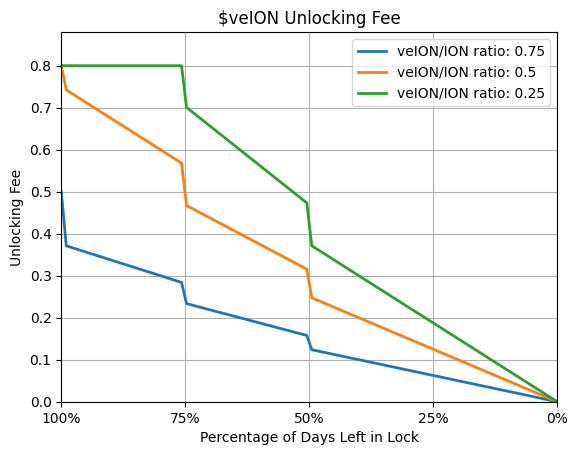

# veION

Users wishing to participate in the most important parts of the Ionic protocol can LP their ION tokens in one of our liquidty pools mentioned below, and lock their LP tokens for $veION. In exchange for $veION users can:\
\
1\. Direct ION token emissions to lenders and borrowers of tokens within both Ionic’s main and isolated pools.

2\. Earn bribes by protocols wishing to incentivize the utilization of their tokens.

3\. Earn trading fees on their existing LP positions

4\. Unlock their [Ionic Score](ionic-score.md) and, if qualified, earn a % of protocol revenue.&#x20;

In addition to unlocking the Ionic Score, **users must have 2.5% of collateral locked as $veION in order to receive either Ionic’s base emissions to our main pools or $ION tokens emitted via $veION voting.**

## Liquidity Options & Locking

Given Ionic’s deployment to multiple blockchains, we have different liquidity options across our deployments. These deployments are as follows:

* Mode
  * 50/50 ION/MODE Velodrome (LIVE)
  * 80/20 ION/ETH Balancer (TBC)
* Base
  * 50/50 ION/WETH Aerodrome (LIVE)
  * 80/20 ION/ETH Balancer (TBC)
* Optimism
  * 50/50 ION/OP Velodrome (TBC)
  * 80/20 ION/ETH Balancer (TBC)
* BOB
  * 50/50 ION/WETH Velodrome (TBC)

All LP token positions are eligible to be staked for $veION and can direct voting emissions. Further, additional benefits and liquidity incentives may be awarded to LPers, based on the protocol used.

Voting power is not 1:1 per LP token locked but will be boosted via a linear time-lock system:

* 180 Days - 1x boost
* 365 Year - 1.25 boost
* 1.5 Year ns - 1.5x boost
* 2 Years - 2x boost

We understand that all LPers within our ecosystem may have varying user profiles, thus $veION holders are able to unlock their LP’d $ION early. If users wish to unlock their $veION, they are subject to a fee based on both linearly decays based on the amount of time left in the lock, based on the global ratio of $veION to circulating $ION.

<figure><figcaption></figcaption></figure>

<figure><figcaption></figcaption></figure>

## Voting & Bribing

Ionic’s token emissions will be directed by $veION holders to the lenders and borrowers active within the protocol. This mirrors Velodrome and works as follows:

Per epoch:

* Protocols with native tokens supported as collateral via isolated pools or contained within the main pool on Ionic may bribe $veION holders to vote for emissions on their pool
* $veION holders vote on which assets within Ionic should be incentivized via token emissions. Voters earn bribes based on their voting behavior.
* Incentivized assets will receive token emissions based on the type of pool the asset is in:
  * Default emissions will be based on the assets utilization rate
    * If utilization is high, more rewards will be directed to supplier APR to increase liquidity
    * If utilization is low, more rewards will be directed to borrower APR to incentivize usage
    * Generally - emissions to lenders boost supply APRs, emissions to borrowers subsidize interest
  * However, bribers will have the ability to direct bribes (and, thus, emissions) to a specific side of the pool (lending or borrowing or a split of some kind) via gauges provided on the Ionic front-end UI.

**Note:** In order to receive emissions lenders/borrowers must have 2.5% of their collateral worth of $ION locked as $veION, **this is also the amount of $veION needed to activate your Ionic Score.**

With the release of our voting mechanics, the Ionic team expects to develop or integrate a delegation or Hidden-hand style strategy system. We believe that many protocols will compete to direct ION emissions and make isolated borrowing/lending attractive for Ionic users. Increased competition will not only result in a more frictionless money market experience for our users, but enhanced yield opportunities for $veION holders.
